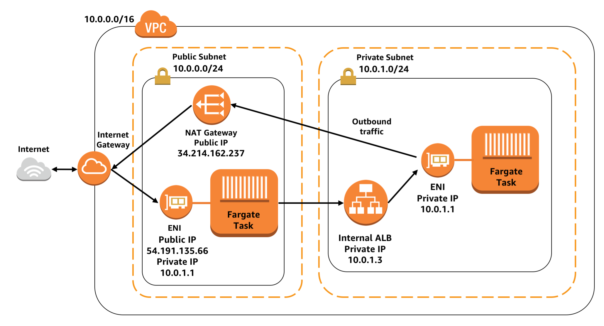

# CloudFormation Templates for AWS Fargate deployments

This is a collection of CloudFormation templates for launching containers in Fargate with a variety of different networking approaches. Fargate is designed to give you significant control over how the networking of your containers works, and these templates show how to host public facing containers, containers which are indirectly accessible to the public via a load balancer but hosted within a private network, and private containers that can not be accessed by the public.

## Instructions

### 1. Choose a Fargate cluster networking stack:

Launch the stack of your choice, and give it a friendly name in CloudFormation. For example "production" or "qa". You'll be using the name of this stack later for launching a service.

Choose one of the following:

#### [Public VPC](fargate-networking-stacks/public-vpc.yml):

Fully public networking stack. All containers launched in this stack will have public IP addresses and can be directly accessible on the internet via an internet gateway, or indirectly accessible via a public facing load balancer. (Note that by default the security groups are configured so that the containers only accept traffic from the load balancer, even though they have public IP addresses. The capability for direct access is there if the security group is changed though.)

#### [Public + Private VPC](fargate-networking-stacks/public-private-vpc.yml):

Networking stack with both public and private subnets. This stack offers the most flexibility, with the ability to host both public facing services, as well as private, internal services for which there is no public access.
Containers that are run in the private subnet can access the internet via NAT
gateway.

### 2. Choose a service template:

There are three service templates to choose between. 

#### [Public Subnet, Public Load Balancer](service-stacks/public-subnet-public-loadbalancer.yml):

This template requires the public subnet or public + private subnet networking stack. It launches containers that have public IP addresses in a public subnet, so they are directly accessible to the public. It also associates the containers with a public facing load balancer.

#### [Private Subnet, Public Load Balancer](service-stacks/private-subnet-public-loadbalancer.yml):

This template requires the public + private subnet networking stack. It launches containers that have no public IP address, and which are hosted in private subnet. If they need to make external requests, they can initiate outbound network traffic through a NAT gateway in the public subnets. The only way to get network traffic to these private containers is via a public facing load balancer which is hosted in the public subnets.

#### [Private Subnet, Private Load Balancer](service-stacks/private-subnet-private-loadbalancer.yml):

This template requires the public + private subnet networking stack. It launches containers that are hosted in a private subnet, and have no public IP address. The containers are behind an internal load balancer which is hosted in the private subnet, with no public IP address either. This allows other containers in the subnet to make requests against the load balancer, but the load balancer is not accessible to the public internet. These private services can still initiate outbound access the internet via the NAT gateway hosted in the public subnets.

Each of the above CF stacks has default values prefilled for launching a simple Nginx container, but can be customized. It's important to make sure the "StackName" value is filled in with the same name that you selected for the name of your networking stack chosen in step #1.
